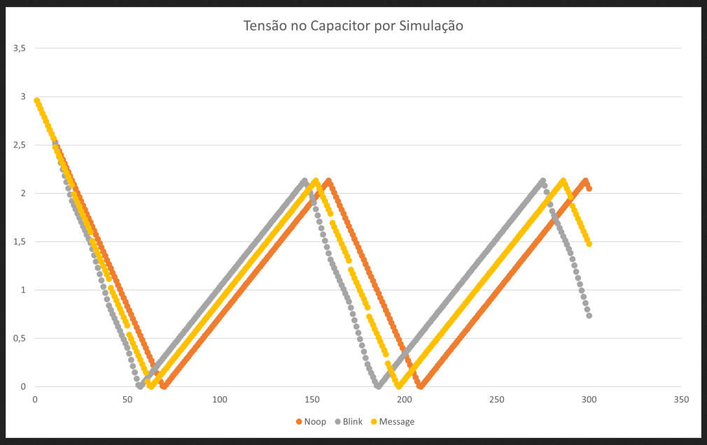

# PFP
Entregável da disciplina INF2102 - Projeto Final de Programação

O módulo simulador necessita apenas que a máquina consiga rodar códigos python.

O código harvest_sim.py tem como entrada o log da simulação do TOSSIM e simula o consumo de energia de dispositivos IoT de Energia Harvesting em uma Rede de Sensores Sem Fio, fazendo um novo log, que permite comparar os comportamentos, além de exportar o nível da tensão armazenada no capacitor do dispositivo de um csv para que seja possível plotar esse perfil de carga. Os resultados obtidos nesse teste estão apresentados nessa imagem: 

Os arquivos disponibilizados nesse repositório apresentam a demonstração do consumo de energia de um único dispositivo em três cenários.
- No cenário noop, o dispositivo fica ativo mas sem realizar nenhuma tarefa.
- No cenário blink, o dispositivo liga e desliga um led a cada segundo.
- No cenário message, o dispositivo envia sinais de rádio de 3 ms a cada segundo.

Com relação ao código em si, o módulo consiste da implementação do módulo Node que chama seus métodos handlers de acordo com o evento identificado no log recebido pelo simulador.

Futuramente, deseja-se realizar os testes integrados no simulador, de modo a utilizar mais nós na rede, bem como avaliar o gasto de energia a partir da configuração da rede.

